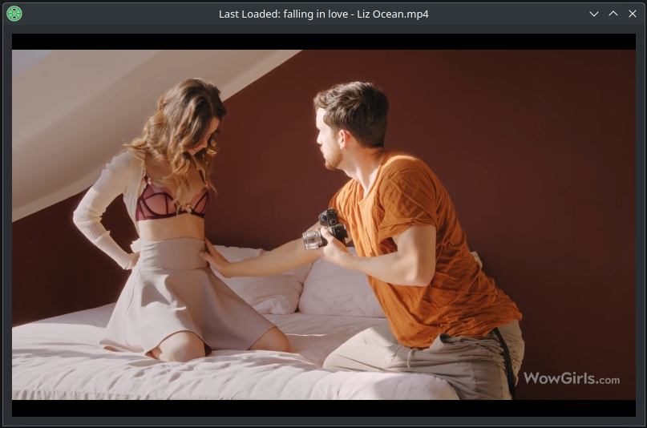

# No Skip Video Player in Python, PyQt

It is like eating a whole big cake. 
- No seeking functions(You gotta eat up the whole cake)
- Timer to enjoy chunks of slices.
- Play from the previous loaded file and starts at where it's left.
- Remove the buttons and only shortcuts to make experience better. 

### Shortcuts
- Shift O >> load a file
- Shift T >> Set timer
- Shift I >> Check current playing point in minutes.

The previous loaded file and the time point are recorded in the ~/.local/share/no-skip-video-player/last_position.json

#### If you like porn and erotic arts. Use this as a reward system by taking this addiction to your advantage. 

This is just a minimal python application. It is better if you could make desktop shortcut and keyboards shortcut to better suit your workflow. 